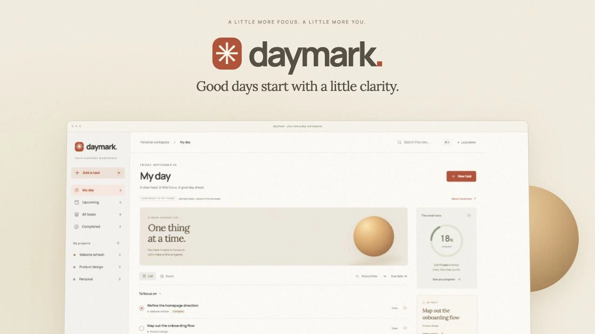

# Daymark

A calm home for tasks, projects, and the days ahead. Daymark reworks the original `ubiquiti-todo` assignment into a responsive workspace with warm paper surfaces, editorial typography, and focused task views.

Built by [Akash Pathak](https://github.com/akkikumar72) with Next.js, React, TypeScript, Tailwind CSS, and Supabase. This is an independent project, not an official Ubiquiti product.

## Run locally

Use **Node.js 22.6 or newer** and **Yarn Classic**.

```sh
yarn install --frozen-lockfile
yarn dev
```

Open [localhost:3000](http://localhost:3000). No credentials are needed. The app starts with clearly labeled sample tasks and saves edits in browser-local storage. To choose another port, run `yarn dev -p 3050`.

## The workspace

- **My day, Upcoming, All tasks, and Completed**, plus a sidebar entry for each project. View selection is kept in the URL.
- **Create and edit tasks** with notes, dates, priorities, and To do / In progress / Completed status. Toggle completion, reopen tasks, and undo a deletion until the undo notification is dismissed or the page is left.
- **List and board layouts**, scoped search across task names, notes, and projects, priority filters, and due-date / priority / newest sorting. Board status changes use the task editor; there is no drag-and-drop.
- **Project creation**, workspace progress, local JSON backup, and a sample-data reset with confirmation. A project persists through the tasks it contains; empty custom projects are not stored separately.
- **Responsive navigation and keyboard controls**: `N` adds a task, `Cmd/Ctrl K` focuses search, and `Esc` closes dialogs. Native dialogs trap focus and restore scrolling. Decorative motion respects reduced-motion preferences.

My day includes unfinished tasks due today or earlier and completed tasks due today. Upcoming includes unfinished tasks with a future date. The progress ring measures all workspace tasks, not a historical productivity score. Sidebar badges count unfinished tasks, except Completed.

Local demo data is stored under `daymark.tasks.v1`. It is not uploaded when you sign in. Export a backup before clearing site data; JSON import is not currently provided. The app preserves unreadable stored data and reports the issue instead of silently replacing it.

## Cloud setup

The optional cloud mode preserves the original app’s **single shared workspace** model. All authenticated accounts in the Supabase project can read, edit, and delete workspace tasks. This is not a private-per-user or multi-tenant permission model. Use a dedicated project, restrict account registration to intended collaborators, and review access rules before using real data.

1. Create a Supabase project. In its SQL editor, review and run [`supabase/schema.sql`](supabase/schema.sql). It creates the profile/task tables if needed, adds Daymark’s task fields, sets up profile creation, enables RLS, and adds the task table to realtime. The original `tweets` table name is retained to preserve existing task IDs and data. The script does not delete unrelated existing policies; review those when upgrading an older database.
2. Copy `.env.example` to `.env.local`. Set `NEXT_PUBLIC_SUPABASE_URL` and `NEXT_PUBLIC_SUPABASE_ANON_KEY` to the project URL and its public anon key. Never put a service-role key in a `NEXT_PUBLIC_*` variable.
3. Configure Supabase Auth’s Site URL and allowed redirect URL, including `http://localhost:3000/auth/callback` for the default local port. Use your actual origin and port for other environments.
4. Enable email/password authentication. To use GitHub sign-in, enable and configure the GitHub OAuth provider in Supabase and add the callback URL Supabase provides to the GitHub OAuth app.
5. Restart the app and use `/signin` or `/signup`. Authenticated visits use cloud tasks; `/?demo=1` always opens the separate local demo. `/user` contains the account and sign-out controls.

Cloud reads are paginated in batches of 1,000 with deterministic ordering, rather than silently truncating the first page. Supabase’s API row limit should be at least 1,000. Realtime changes reload the workspace; returning to the tab also refreshes cloud tasks. The `Live sync` indicator appears only after the realtime subscription connects. Mutations show errors rather than pretending to save.

The SQL is a setup artifact and is never applied automatically. Cloud credentials were not available for the redesign verification, so live account creation, OAuth, RLS, and cross-client realtime still require validation against your own configured project.

## Commands

```sh
yarn test       # Task filtering, dates, sorting, persistence validation
yarn lint       # Next.js ESLint checks
yarn typecheck  # TypeScript
yarn build      # Production build
yarn start      # Serve the production build
yarn verify     # Run all four checks
```

## Project map

| Path                            | Responsibility                                              |
| ------------------------------- | ----------------------------------------------------------- |
| `src/features/home/components/` | Workspace, task views, and task editor                      |
| `src/lib/tasks.ts`              | Task model, view filters, calendar dates, and sample data   |
| `src/hooks/useTasks.ts`         | Browser persistence, Supabase mutations, realtime lifecycle |
| `src/util/databaseClient.ts`    | Existing typed Supabase access layer                        |
| `src/components/auth/`          | Email and GitHub authentication, configuration guidance     |
| `src/app/user/`                 | Account and profile routes                                  |
| `src/app/globals.css`           | Responsive visual system and reduced-motion styles          |
| `supabase/schema.sql`           | Additive setup/migration and shared-workspace policies      |
| `tests/tasks.test.mjs`          | Task-domain regression tests                                |

The redesign keeps the original Next.js 13 / React 18 stack. The decorative sun is CSS, with no WebGL or extra UI dependency. Manrope and Lora are served through `next/font`; Phosphor icons come from the existing `react-icons` package.

## Design references and verification

[Todoist’s task management](https://www.todoist.com/task-management) informed the dedicated daily, future, and project views. [TickTick’s feature overview](https://www.ticktick.com/features) informed the switch between focused lists and status boards. Daymark uses its own visual identity, copy, and assets.

See [`docs/VERIFICATION.md`](docs/VERIFICATION.md) for the tested workflows and the cloud verification boundary. README imagery uses the running application with sample tasks.
